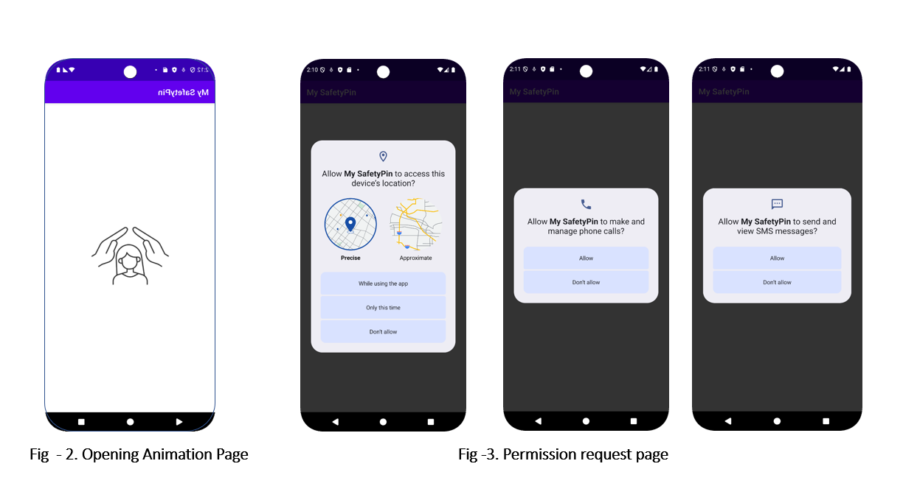
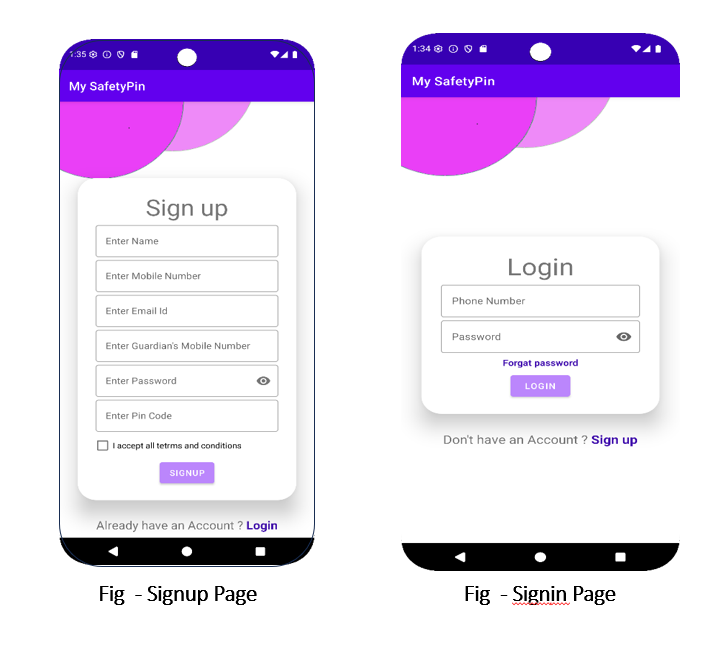
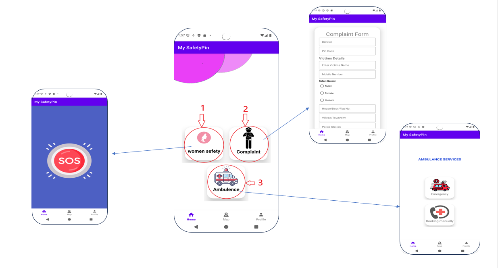
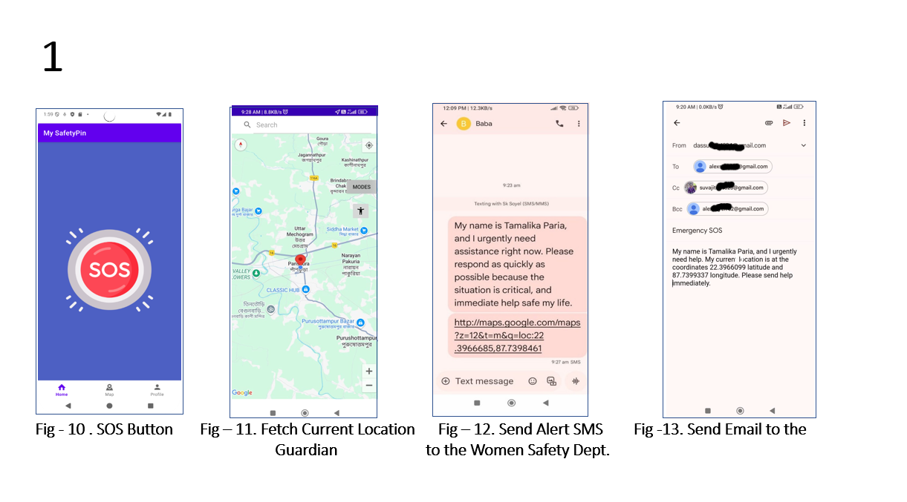
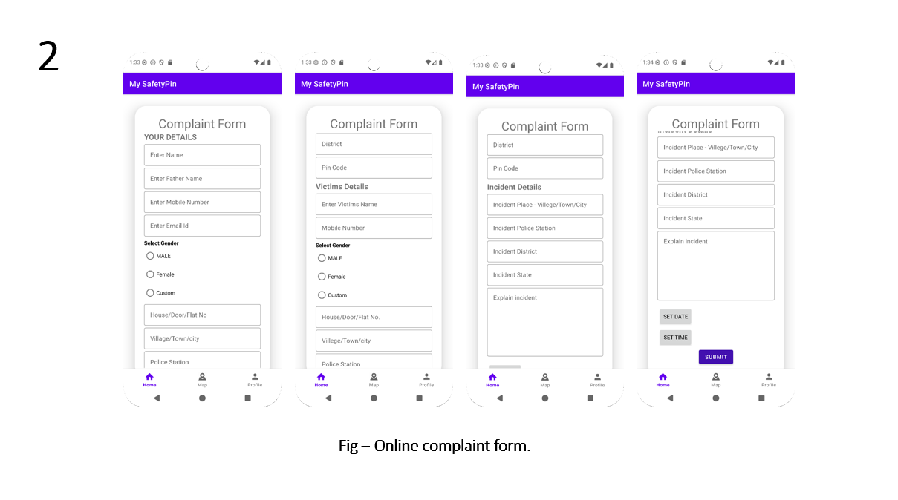
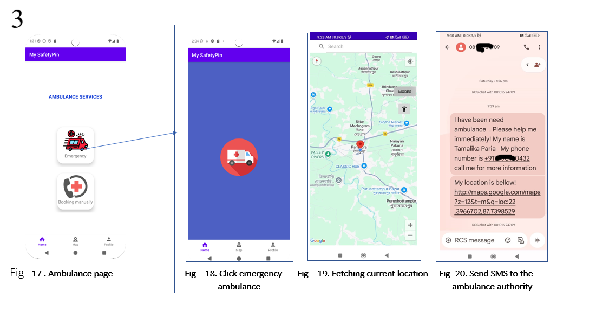
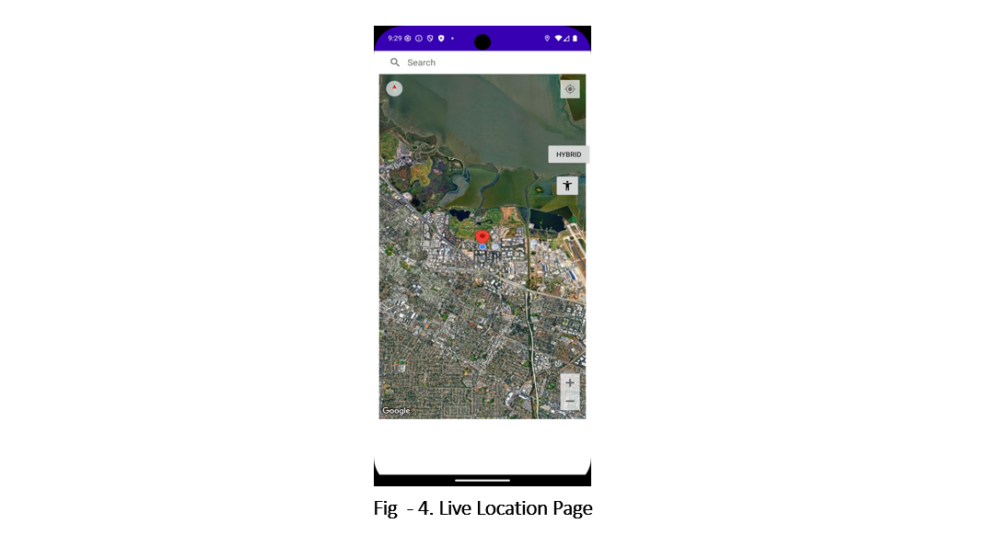
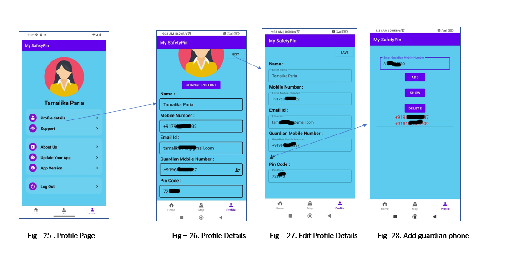

<div align="center">
  
# 🛡️ My_SafetyPin

<p align="center">
  <b>Women Safety Android Application</b>
</p>

<p align="center">
  A Graduation Final Year Project developed to provide women with quick access to emergency assistance and safety services.
</p>

<p align="center">


</p>

</div>

---

## 📌 About the Project

**My_SafetyPin** is an Android-based **Women Safety Application** developed as our **Graduation Final Year Project**.

The application provides a centralized platform for emergency assistance and safety services. It combines features such as **SOS emergency alerts, real-time location sharing, online complaint reporting, ambulance assistance, nearby police station access, and user profile management**.

The main objective of the project is to use mobile technology and location-based services to help women communicate their emergency situation and location to trusted contacts and relevant authorities more quickly.

---

## 🎓 Graduation Final Year Project

This project was developed as part of our **Graduation Final Year Project**.

The project demonstrates practical implementation of:

* Android Application Development
* Java Programming
* XML UI Design
* SQLite Database Management
* Location Services
* Google Maps API
* Emergency SMS Communication
* Email Communication
* Software Testing

---

## 🎯 Problem Statement

Women continue to face safety threats in everyday life, both in public and private spaces. Traditional safety measures may not always provide immediate assistance during emergency situations.

There is a need for an **all-in-one mobile application** that provides quick access to:

* 🚨 SOS emergency alerts
* 📝 Complaint reporting
* 🚑 Ambulance assistance
* 📍 Real-time location sharing
* 👮 Police assistance

---

## 💡 Proposed Solution

**My_SafetyPin** provides a centralized Android platform for emergency and safety assistance.

The application allows users to:

* Create an account and log in
* Manage their personal profile
* Add a guardian phone number
* Trigger an SOS alert
* Fetch their current location
* Send emergency SMS alerts
* Send emergency emails
* Submit online complaints
* Request ambulance assistance
* Access nearby police stations

---

# ✨ Key Features

## 🚨 SOS Emergency Alert

The SOS feature allows users to initiate emergency communication when they are in danger.

### Emergency Flow

```text
Press SOS Button
       ↓
Fetch Current Location
       ↓
Generate Emergency Alert
       ↓
Send SMS to Guardian
       ↓
Send Email to Women Safety Department
```

---

## 📍 Real-Time Location

The application can fetch the user's current location using location services.

The location can be used during emergency communication to help guardians and authorities identify the user's current position.

---

## 📝 Online Complaint

Users can report safety incidents through an online complaint form.

### Complaint Flow

```text
Open Complaint Form
       ↓
Enter Incident Details
       ↓
Submit Complaint
       ↓
Prepare Email
       ↓
Send to Relevant Authority
```

---

## 🚑 Ambulance Assistance

The application provides an emergency ambulance feature for users who require medical assistance.

### Ambulance Flow

```text
Open Ambulance Section
       ↓
Select Emergency
       ↓
Fetch Current Location
       ↓
Send Emergency SMS
       ↓
Ambulance Authority
```

---

## 👮 Nearby Police Stations

The application provides access to nearby police station information to help users locate police assistance when required.

---

## 👤 User Profile

Users can manage their profile information and guardian details.

Features include:

* View profile
* Edit profile
* Add guardian phone number

---

## 🔐 User Authentication

The application provides a basic user authentication system.

### Signup

New users can create an account by providing the required information.

### Login

Registered users can log in using their mobile number and password.

---

# 🏗️ System Architecture

```text
                         ┌─────────────────┐
                         │      USER       │
                         └────────┬────────┘
                                  │
                                  ▼
                         ┌─────────────────┐
                         │  My_SafetyPin   │
                         │   Android App   │
                         └────────┬────────┘
                                  │
              ┌───────────────────┼───────────────────┐
              │                   │                   │
              ▼                   ▼                   ▼
        ┌───────────┐       ┌────────────┐      ┌────────────┐
        │    SOS    │       │ Complaint  │      │ Ambulance  │
        └─────┬─────┘       └──────┬─────┘      └──────┬─────┘
              │                    │                    │
              ▼                    ▼                    ▼
        ┌───────────┐       ┌────────────┐      ┌────────────┐
        │ Location  │       │   Email    │      │    SMS     │
        │  Service  │       │  Service   │      │  Service   │
        └─────┬─────┘       └────────────┘      └────────────┘
              │
              ▼
        ┌─────────────┐
        │   Guardian  │
        │    Alert    │
        └─────────────┘
```

---

# 🔄 Application Workflow

```text
Application Launch
       ↓
Permission Request
       ↓
Signup / Login
       ↓
Home Page
       ↓
Choose Safety Service
       │
       ├── SOS
       │     ↓
       │  Current Location
       │     ↓
       │  SMS + Email Alert
       │
       ├── Complaint
       │     ↓
       │  Complaint Form
       │     ↓
       │  Submit Complaint
       │
       ├── Ambulance
       │     ↓
       │  Emergency
       │     ↓
       │  Current Location
       │     ↓
       │  SMS Alert
       │
       ├── Police Stations
       │     ↓
       │  Nearby Police Assistance
       │
       └── Profile
             ↓
          View / Edit Details
```

---

# 🛠️ Technology Stack

<div align="center">

| Technology          | Purpose                                 |
| ------------------- | --------------------------------------- |
| **Android Studio**  | Android application development         |
| **Java**            | Application logic                       |
| **XML**             | User interface design                   |
| **SQLite**          | Local database                          |
| **Google Maps API** | Location tracking and map visualization |
| **SMS**             | Emergency communication                 |
| **Email**           | Complaint and emergency communication   |

</div>

---

# 🗄️ Database

The application uses **SQLite** as a lightweight local database.

The database is used for application data such as:

* User information
* Complaint records
* Emergency records

---

# 🧪 Testing

The application was tested to identify defects and improve reliability and performance.

Testing approaches include:

### ✅ Unit Testing

Testing individual components of the application.

### ✅ Black Box Testing

Testing application functionality without focusing on the internal implementation.

### ✅ White Box Testing

Testing internal application logic and code paths.

### ✅ Integration Testing

Testing the interaction between different application modules.

---

# 📱 Application Screens

The application includes the following major screens:

### 🔐 Authentication

* Opening Animation
* Permission Request
* Signup
* Login

### 🏠 Main Application

* Home Page
* SOS
* Location Fetching
* Emergency Alert

### 📝 Complaint

* Complaint Form
* Complaint Details
* Complaint Submission

### 🚑 Ambulance

* Ambulance Page
* Emergency Option
* Location Fetching
* SMS Alert

### 👤 Profile

* Profile Page
* Profile Details
* Edit Profile
* Guardian Phone Number

---

# 📸 Screenshots

### ╰┈➤ Opening Page



### ➜🚪 SignIn & SignUp Page



### 🏠 Home Screen



### 🚨 SOS Emergency




### 📝 Complaint Form



### 🚑 Ambulance Service



### 📍 Location



### 👤 User Profile



---

# 🚀 Installation

## 1. Clone the Repository

```bash
git clone https://github.com/byteMaster-Soyel/My_SafetyPin_Android_app.git
```

## 2. Open the Project

Open the cloned project in **Android Studio**.

## 3. Configure the Project

* Allow Android Studio to synchronize Gradle files.
* Make sure the required Android SDK is installed.
* Configure the required Google Maps API key.
* Check the required application permissions.

## 4. Connect an Android Device

Connect a physical Android device with USB debugging enabled or start an Android Emulator.

## 5. Run the Application

Click the **Run ▶** button in Android Studio to build and launch the application.

---

# 🔑 Required Permissions

Depending on the Android version and implemented functionality, the application may require permissions for:

* 📍 Location
* 📱 SMS
* 📞 Emergency communication
* 🌐 Internet
* 📧 Communication services

---

# 📖 APIs & Services

## 🗺️ Google Maps API

Used for location-related functionality and map visualization.

## 📍 Location Services

Used to obtain the user's current location during emergency situations.

## 📱 SMS Service

Used to send emergency alerts to guardians and ambulance authorities.

## 📧 Email Service

Used for emergency communication and complaint reporting.

---

# ⚠️ Limitations

The current implementation has some limitations:

* Requires network connectivity for location-related functionality.
* SMS functionality depends on mobile network availability and SMS balance.
* Offline emergency functionality is limited.
* Advanced automated threat detection is not currently implemented.
* Multimedia evidence collection is not currently implemented.
* Integration with official authorities is limited.
* Some advanced Google Maps functionality is not available.

---

# 🚀 Future Enhancements

Future versions of **My_SafetyPin** can include:

### 🤖 Artificial Intelligence

* AI-based threat detection
* AI chatbot for emergency guidance

### ⌚ Wearable Integration

Integration with wearable devices for quick emergency activation.

### 📍 Authority Integration

* Improved integration with emergency authorities
* Real-time location sharing with authorized emergency services
* Ambulance service confirmation

### 🎙️ Voice-Activated SOS

Allow users to activate emergency assistance using voice commands.

### 🗺️ AR Navigation

Use Augmented Reality to help users locate safe places.

### 📡 Offline Emergency Mode

Improve emergency functionality when internet connectivity is unavailable.

### 🌍 Multi-Language Support

Add support for multiple languages and improve accessibility.

### ☁️ Improved Data Security

Enhance security and protection of user and emergency-related information.

---

# 📊 Project Status

**Status: Academic Graduation Final Year Project**

The project successfully demonstrates the core concept of an Android-based women safety application using location services and emergency communication features.

The current implementation includes:

* SOS emergency alerts
* Location fetching
* Emergency SMS
* Email communication
* Complaint reporting
* Ambulance assistance
* Police station access
* User authentication
* User profile management


---

# 📂 Repository Structure

```text
My_SafetyPin_Android_app/
│
├── app/
│   ├── src/
│   │   └── main/
│   │       ├── java/
│   │       ├── res/
│   │       │   ├── drawable/
│   │       │   ├── layout/
│   │       │   ├── mipmap/
│   │       │   └── values/
│   │       │
│   │       └── AndroidManifest.xml
│   │
│   ├── build.gradle
│   └── proguard-rules.pro
│
├── screenshots/
│
├── gradle/
│
├── README.md
├── build.gradle
├── settings.gradle
└── gradle.properties
```

---

# 🔒 Privacy & Security

The application may process information such as:

* User profile information
* Guardian contact information
* Complaint information
* Emergency records
* Current location information

The application uses **SQLite** for local data storage and location services for emergency location functionality.

> **Important:** My_SafetyPin is an academic project and should not be considered a replacement for official emergency services.

---

# 🤝 Contributing

Contributions and suggestions are welcome.

### Fork the Repository

```bash
git fork https://github.com/byteMaster-Soyel/My_SafetyPin_Android_app.git
```

### Create a Branch

```bash
git checkout -b feature/new-feature
```

### Commit Changes

```bash
git add .
git commit -m "Add new feature"
```

### Push Changes

```bash
git push origin feature/new-feature
```

Then create a Pull Request.

---

# ⭐ Support

If you find **My_SafetyPin** useful or interesting, please consider giving this repository a ⭐ **Star** on GitHub.

---

# 📜 License

This project was developed as a **Graduation Final Year Project** for educational and academic purposes.

---


# 👥 Project Team & 👨‍💻 Authors

— Graduation Final Year Project —

<div align="center">
  
| # | Team Member        |
| - | ------------------ |
| 1 | **SK SOYEL**       |
| 2 | **ARKAMITA SAHA**  |
| 3 | **TAMALIKA PARIA** |
| 4 | **SUVAJIT DAS**    |

---
  
# ❤️ My_SafetyPin

<p align="center">

### 🛡️ Safety • Security • Emergency Assistance

**Developed with ❤️ by the My_SafetyPin Graduation Project Team**

**SK SOYEL • ARKAMITA SAHA • TAMALIKA PARIA • SUVAJIT DAS**

<br>
<b>My_SafetyPin — Empowering Women's Safety Through Technology</b>
</br>
</p>
</div>
